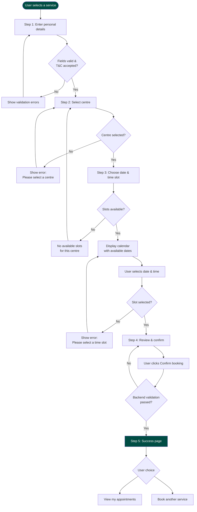

# Booking Workflow

```mermaid
flowchart TB
    A(["User selects a service"]) --> B["Step 1: Enter personal details"]
    B --> B1{"Fields valid &\nT&C accepted?"}
    B1 -- No --> B2["Show validation errors"]
    B2 --> B
    B1 -- Yes --> C["Step 2: Select centre"]
    C --> C1{"Centre selected?"}
    C1 -- No --> C2["Show error:\nPlease select a centre"]
    C2 --> C
    C1 -- Yes --> D["Step 3: Choose date & time slot"]
    D --> D1{"Slots available?"}
    D1 -- No --> D2["No available slots\nfor this centre"]
    D2 --> C
    D1 -- Yes --> D3["Display calendar\nwith available dates"]
    D3 --> D4["User selects date & time"]
    D4 --> D5{"Slot selected?"}
    D5 -- No --> D6["Show error:\nPlease select a time slot"]
    D6 --> D3
    D5 -- Yes --> E["Step 4: Review & confirm"]
    E --> F["User clicks Confirm booking"]
    F --> H{"Backend validation\npassed?"}
    H -- No --> E
    H -- Yes --> K["Step 5: Success page"]
    K --> L{"User choice"}
    L --> L1["View my appointments"] & L2["Book another service"]

    style A fill:#004d44,color:#fff
    style K fill:#004d44,color:#fff
```
